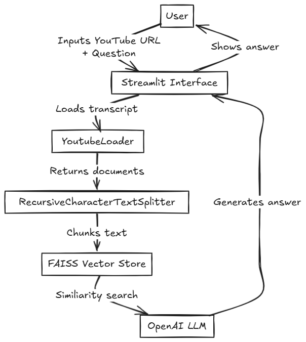
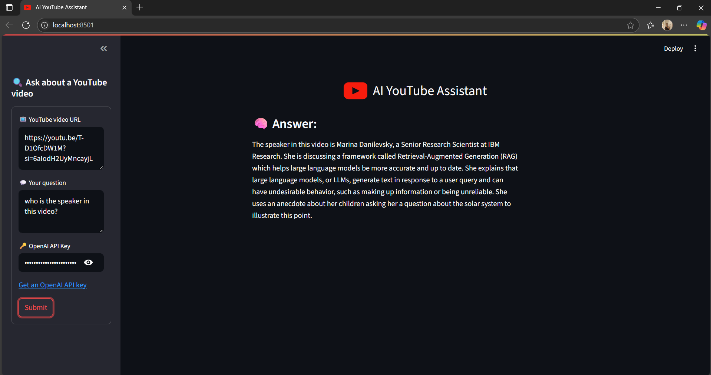
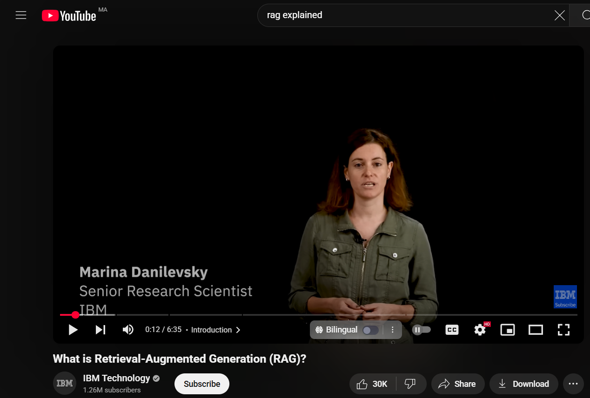

#  YouTube AI Assistant

A Python-based AI assistant that uses YouTube video transcripts to answer questions about the video content. Built with LangChain, OpenAI, and Streamlit for an interactive user experience.

---

## Features

- Loads and processes YouTube video transcripts automatically.
- Uses OpenAI language models to provide detailed answers based on the transcript.
- Vector search over transcript chunks with FAISS for efficient retrieval.
- Simple and user-friendly Streamlit interface for easy interaction.

---
## Architecture

Below is the architecture diagram of the YouTube AI Assistant:


---
## Demo Screenshot





---

## Installation

1. Clone the repository:

```bash
git clone https://github.com/yourusername/youtube-ai-assistant.git
cd youtube-ai-assistant
````

2. Create and activate a virtual environment (optional but recommended):

```bash
python -m venv .venv
source .venv/bin/activate  # On Windows: .venv\Scripts\activate
```

3. Install dependencies:

```bash
pip install -r requirements.txt
```

4. Set up environment variables:

Create a `.env` file in the project root and add your OpenAI API key:

```
OPENAI_API_KEY=your_openai_api_key_here
```

---

## Usage

Run the Streamlit app:

```bash
streamlit run main.py
```

Open the URL provided in your browser, input a YouTube video URL and ask questions about the video.

---

## Dependencies

* Python 3.8+
* langchain
* langchain\_community
* langchain\_openai
* streamlit
* FAISS
* python-dotenv
* pytube
* youtube-transcript-api

(See `requirements.txt` for exact versions)

---

## Author

TAHA BOUHAFA

---

## License


Feel free to use, modify, and share this project for any purpose.  
No restrictions, no warranties — just enjoy and build awesome things!  
---

## Contact

For questions or issues, open an issue on GitHub or contact me at [tahabouhafa1@gmail.com](mailto:tahabouhafa1@gmail.com)


